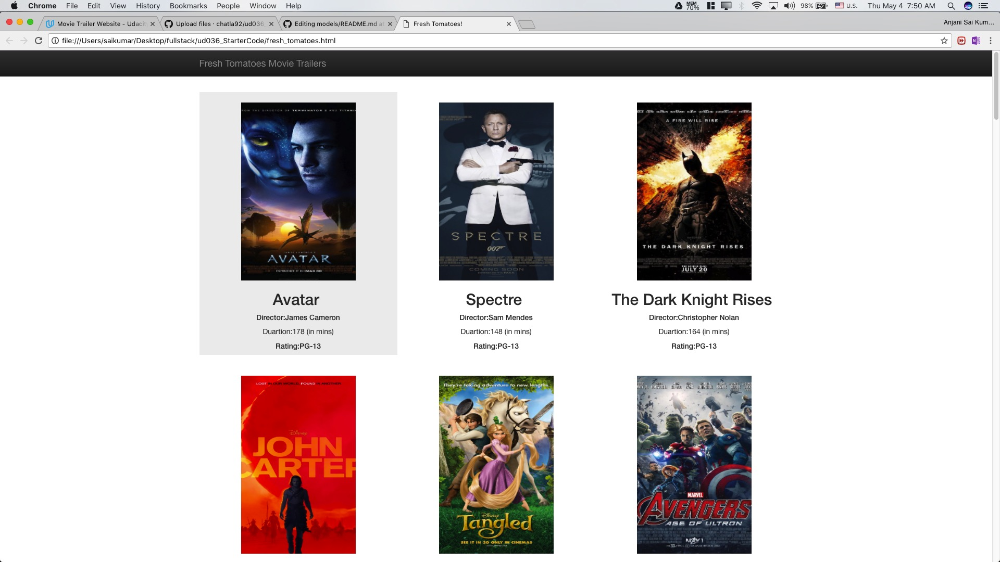
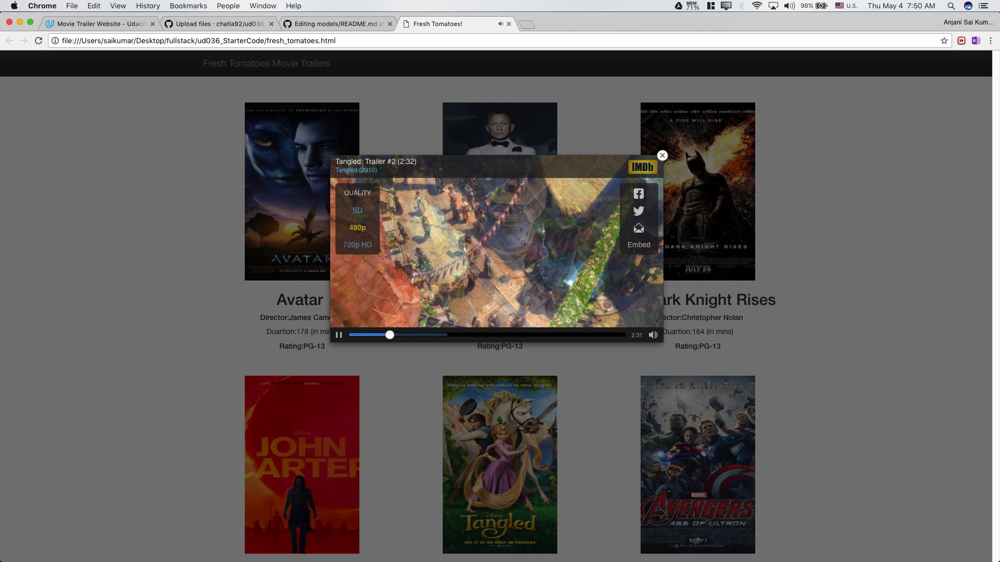

# Fresh Tomatoes website
Website provides a list of movies and will playback the trailers of the movies clicked upon.

## Initial Setup
1) python 2.7 or above is required
2) Place all the fresh_tomatoes.py, media.py and ent_center.py in the same folder.
3) Place the dataset also in the same folder. Use movies_trailers.csv provided along with the code. If a different data set is used, 
   change the input filename in ent_center.py file. Please make sure you follow the schema of the dataset. 

## Code
There are 4 files that are essential for this website 
  1) media.py - This file contains the class definitions required for storing and handling the movie database
  2) fresh_tomatoes.py - This file defines the HTML and CSS structures for the website
  3) ent_center.py - This file reads all the movie data from the dataset and embeds the details into the final HTML file.
  
## Usage
After making sure that all the 4 files are in the same folder, execute the porgram using `python ent_center.py`

An website pops up in your in browser with fresh_tomatoes website

## Dataset
The data in `movies_trailer.csv` is a new dataset generated using [*Kaggle IMDB Dataset*](https://www.kaggle.com/deepmatrix/imdb-5000-movie-dataset)

The script imdb_scrape.py, also present in the folder, reads the imdb link from kaggle's movie_metadata.csv file associated with each movie and does web scraping to find the IMDB video ID for the trailer, poster url and storyline.

The fields sequence in the input file must be Movie Name, storyline, box art image url, video ID, Director, Duration, Rating
## Here is the Ouput:

